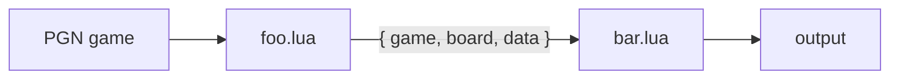

# tictac Lua Plugin Interface

This document specifies the **interface** for tictac's Lua plugin pipeline.
It defines what a plugin looks like, what it receives, and what it returns.

---

## 1. Concept

tictac reads a PGN database and streams each game through an ordered pipeline of
Lua plugins:

```sh
tictac --file database.pgn --plugin foo.lua --plugin bar.lua
```

- Plugins run in the **order given on the command line**.
- For each game, the game flows through `foo.lua` then `bar.lua`.
- Each plugin can **inspect, annotate, filter, fork, or aggregate** games, and
  pass data to the next plugin in the chain.

A single, uniform value -- the **pipeline value** `{ game, board, data }` --
travels through the chain. A plugin receives the previous plugin's output and
returns the input to the next plugin. This symmetry is the core of the design
and directly satisfies the requirement of carrying *the game*, *the current
board*, and a *user argument* between stages.



---

## 2. Command-line surface

```sh
tictac --file <db.pgn> [--plugin <spec>]... [--output <file>] [--jobs N] [--on-error <mode>]
```

| Flag | Meaning |
|------|---------|
| `--file`, `-f` | Input PGN database (repeatable; concatenated). |
| `--plugin`, `-p` | A plugin spec (see below). Repeatable; defines pipeline order. |
| `--output`, `-o` | Where surviving games are written (default: stdout, PGN). `-` = stdout, omit with `--no-output`. |
| `--no-output` | Discard the default game stream (useful for pure reporters). |
| `--on-error` | `abort` \| `drop` \| `pass` (default `abort`) -- how a plugin's failing `process()` is handled: `abort` halts the run, `drop` drops the game, `pass` passes it through unchanged; all three log the error. A failing `init` always aborts. |
| `--jobs`, `-j` | Reserved: parallel game workers. Plugins must be written to tolerate it (see §9). |

### Plugin spec & arguments

A plugin spec is a Lua file path, optionally followed by `key=value` arguments:

```sh
--plugin "analyze.lua depth=22 multipv=3 engine=/usr/bin/stockfish"
--plugin filter.lua
--plugin "split.lua by=eco dir=out/"
```

Arguments are exposed to the plugin as `ctx.args` (see §5). Values are strings;
typed accessors (`ctx.args:number`, `:bool`, …) coerce them.

A bare key with no `=` is shorthand for `key=true`, so `--plugin "flag.lua
verbose"` and `--plugin "flag.lua verbose=true"` parse identically. This gives
`bool` a sharp edge worth calling out: `foobar.lua foo` sets `foo` to `true`,
while `foobar.lua foo=` -- an explicitly *empty* value -- sets it to `false`
rather than leaving it absent (see §5's accessor rules for the full story).

---

## 3. Plugin structure

A plugin file **returns a table** describing the plugin. All fields except
`process` are optional.

```lua
-- echo.lua
local plugin = {}

plugin.meta = {
  name        = "echo",
  version     = "1.0.0",
  description = "Pass games through unchanged; demo of the lifecycle.",
  -- Optional declared argument schema; used for validation and --help.
  args = {
    verbose = { type = "bool", default = false, help = "Log every game." },
  },
}

-- Called once, before any game. Set up engines, open files, read args.
function plugin.init(ctx)
end

-- Called once per game. The heart of the plugin. See §4.
function plugin.process(input, ctx)
  return input            -- pass through unchanged
end

-- Called once, after the last game. Emit reports/aggregates here.
function plugin.finish(ctx)
end

return plugin
```

### Lifecycle

| Hook | When | Typical use |
|------|------|-------------|
| `init(ctx)` | Once, at startup. | Create UCI engines, open output writers, validate args. |
| `process(input, ctx)` | Once per game, in pipeline order. | Inspect / annotate / filter / fork. |
| `finish(ctx)` | Once, after all games. | Emit histograms, reports, opening trees, summaries. |

Engines and writers opened via `ctx` are **closed automatically** by tictac
after `finish`.

---

## 4. The pipeline value & flow control

### Input

`process` receives `(input, ctx)` where `input` is the **pipeline value**:

| Field | Type | Description |
|-------|------|-------------|
| `input.game` | [`Game`](#game) | The game being processed. |
| `input.board` | [`Board`](#board) | The "current" position cursor. For the first plugin it defaults to the game's **final position**. Downstream plugins receive whatever the previous plugin forwarded. |
| `input.data` | any | Arbitrary Lua value passed from the previous plugin. `nil` for the first plugin. |

### Output

`process` returns a **result table** (or shorthand, see below):

| Field | Type | Default | Description |
|-------|------|---------|-------------|
| `action` | string | `"pass"` | Flow control: `"pass"`, `"drop"`, `"stop"`, or `"abort"`. |
| `game` | `Game` | `input.game` | Game forwarded to the next plugin. |
| `board` | `Board` | `input.board` | Board cursor forwarded to the next plugin. |
| `data` | any | `input.data` | User payload forwarded to the next plugin. |

```lua
function plugin.process(input, ctx)
  -- ... analysis ...
  return {
    action = "pass",
    game   = input.game,
    board  = somePosition,   -- e.g. hand a "puzzle position" to the next plugin
    data   = { eco = "B33", tags = { "sharp" } },
  }
end
```

### Actions

| Action | Effect |
|--------|--------|
| `"pass"` | Forward to the next plugin; if last plugin, the game goes to the default output. |
| `"drop"` | Remove the game from the pipeline (filters, dedup). Downstream plugins do not see it. |
| `"stop"` | Finish this game through the rest of the pipeline (it is still emitted), then stop reading the database (graceful early exit; e.g. `--limit` plugins). `finish` still runs. |
| `"abort"` | Stop immediately: skip the rest of the pipeline for this game, drop the in-flight game (not emitted), and stop reading the database. `finish` still runs. |

### Shorthands

To keep simple plugins terse:

| Return | Equivalent |
|--------|------------|
| `return input` or `return` (nil) | `{ action = "pass" }` -- pass through unchanged. |
| `return true` | pass through unchanged. |
| `return false` | `{ action = "drop" }`. |
| `return board` (a Board) | pass, with `board` forwarded as the new cursor. |

### Fan-out (one game → many)

Return an **array** of result tables to inject multiple games into the rest of
the pipeline (variation extractors, position slicers). Each element continues
independently from this plugin onward:

```lua
return {
  { game = white_repertoire },
  { game = black_repertoire },
}
```

---

## 5. `ctx` -- the execution context

`ctx` is shared across all hooks of **one plugin** and lives for the whole run.
It is how a plugin talks to tictac.

| Member | Description |
|--------|-------------|
| `ctx.args` | This plugin's parsed CLI arguments (see accessors below). |
| `ctx.shared` | A table shared by **all** plugins and **all** games -- global accumulator / cross-plugin channel. |
| `ctx.scope` | A table private to **this** plugin instance -- its own scratch space, persisting across hooks. |
| `ctx.index` | 1-based index of the current game in the database (valid in `process`). |
| `ctx.engine(path, opts)` | Create / fetch a [UCI engine](#engine) handle (managed & auto-closed). |
| `ctx.open(path, mode?)` | Open a [Writer](#writer) (managed & auto-closed). `mode`: `"w"` (default, truncates) / `"a"` (append). Reopening the same path truncates -- use `"a"` to append. |
| `ctx.out` | The default output [Writer](#writer) (honours `--output`); **`nil` under `--no-output`**, so guard with `if ctx.out then`. Write to it mid-pipeline with `ctx.out:writeGame(game)`. |
| `ctx.log` | `ctx.log.info/warn/error/debug(fmt, ...)` -- structured logging prefixed with plugin + game index. |

### Argument accessors

Arguments are `key=value` pairs on the plugin spec, and **a key may repeat**:

```sh
tictac --file db.pgn --plugin "tag.lua tag=sharp tag=endgame depth=20"
```

Every accessor follows the same rule. When the key is **absent** it returns the
default (`nil`, or an error for `require`); when it appears **once** it returns a
single coerced value; when it appears **more than once** it returns a 1-based
array of coerced values, in command-line order. `list` has no default
argument -- it returns `nil` when the key is absent, and otherwise always
returns an array, splitting each present value on commas.

```lua
ctx.args:get("tag")                  -- "tag=sharp tag=endgame" -> { "sharp", "endgame" }
ctx.args:get("engine", "stockfish")  -- one value -> a string; the default when absent
ctx.args:number("depth", 20)         -- number, or array of numbers if repeated
ctx.args:bool("verbose", false)      -- boolean, or array of booleans if repeated
ctx.args:require("dir")              -- string or array; errors if missing
ctx.args:list("tags")                -- "a,b,c" -> { "a", "b", "c" }; nil if absent
```

The default is optional: `ctx.args:number("depth")` returns `nil` when `depth`
is absent, not `0`. Pass a default only when you want a fallback value.

`number` and `bool` coerce the raw string into a native type and can fail to do
so (`depth=abc`, `verbose=maybe`): on a bad value they print an error to stderr
naming the argument, the value, and the expected type, and return `nil` -- the
default only covers a **missing** key, never a malformed one. `bool` recognises
`true`/`1`/`yes`/`on` and `false`/`0`/`no`/`off`; anything else is a bad value.

An explicitly empty value (`tag=`) is treated the same as `tag` being absent --
every accessor returns its default/`nil` (or errors, for `require`) rather than
a present-but-empty string. **`bool` is the exception**: since a bare flag
(`verbose`, with no `=`) already means `true`, an explicit empty value
(`verbose=`) means `false` instead of absent, letting a caller disable a flag
without dropping it from the spec:

```lua
ctx.args:bool("verbose")   -- absent      -> nil
ctx.args:bool("verbose")   -- "verbose"   -> true
ctx.args:bool("verbose")   -- "verbose=1" -> true
ctx.args:bool("verbose")   -- "verbose="  -> false
ctx.args:bool("verbose")   -- "verbose=0" -> false
```

When a key may repeat, normalise the single/array duality and iterate -- order is
preserved:

```lua
-- "tag.lua tag=sharp tag=endgame"  ->  ctx.args:get("tag") == { "sharp", "endgame" }
local function each(v)
  if v == nil then return {} end
  return type(v) == "table" and v or { v }
end

for i, tag in ipairs(each(ctx.args:get("tag"))) do
  ctx.log.info("tag %d = %s", i, tag)
end
```

### Scope summary

- **`input.data`** → per-game, flows *down* the pipeline (stage to stage).
- **`ctx.scope`** → per-plugin, persists *across games* (this plugin only).
- **`ctx.shared`** → global, persists across games *and* plugins.

---

## 6. API reference

### Cheatsheet

A quick-reference cheatsheet of every type. The subsections that follow give the
**formal definition** of each function -- its arguments, the exact values it can
return, and a short example; consult them whenever the one-line summary here is
not enough.

#### Game

```lua
game:header(key)                 -- header value or nil:  game:header("White")
game:headers()                   -- table: { White=..., Black=..., ECO=..., ... }
game:setHeader(key, value)       -- add/overwrite a header (taggers)
game:removeHeader(key)           -- true if a header was removed, else false

game:result()                    -- "1-0" | "0-1" | "1/2-1/2" | "*"
game:moveCount()                 -- number of plies in the mainline
game:moves()                     -- array of Move (mainline)
game:startBoard()                -- Board at the initial position (respects FEN header)
game:board(ply?)                 -- Board after `ply` half-moves (default: final position)

-- Iterate the mainline. Each node: { ply, move, board_before, board_after, board }
for node in game:positions() do
  -- node.move : Move,  node.board : Board (position after the move)
end

game:pgn()                       -- serialize back to a PGN string
game:clone()                     -- deep copy (safe to mutate before forwarding)
```

#### Board

```lua
board:fen()                      -- FEN string for the current position
board:setFen(fen)
board:sideToMove()               -- "white" | "black"
board:fullmoveNumber()
board:halfmoveClock()
board:legalMoves()               -- array of Move
board:isLegal(uci_or_san)
board:makeMove(uci_or_san)       -- returns a new Board (immutable style)
board:piece(square)              -- e.g. board:piece("e4") -> "P","n",... or nil
board:pieces(filter?)            -- map square->piece, optional filter {color=,type=}

board:isCheck()
board:isCheckmate()
board:isStalemate()
board:isInsufficientMaterial()
board:isRepetition(count?)
board:phase(openingMoves?, endgameThreshold?)   -- "opening" | "middlegame" | "endgame" (heuristic)
board:material()                 -- { white = n, black = n } in centipawns
```

#### Move

```lua
move:san()                       -- "Nf3"
move:uci()                       -- "g1f3"
move:from()                      -- "g1"
move:to()                        -- "f3"
move:piece()                     -- moving piece type, lowercase: "n"
move:isCapture()
move:isCheck()
move:isPromotion()
move:promotion()                 -- "q" | "r" | "b" | "n" | nil
move:comment()                   -- PGN comment text or nil
move:setComment(text)            -- annotate (blunder-tagger writes "?? -3.2")
move:nags()                      -- array of NAG codes  ($1, $2, ...)
move:addNag(code)
```

#### Engine

```lua
local sf = ctx.engine(ctx.args:get("engine", "stockfish"), {
  Threads = 4, Hash = 256,   -- UCI options (setoption)
})

local r = sf:analyse(board, {
  depth   = 22,        -- one of depth / movetime(ms) / nodes is required
  movetime = nil,
  nodes    = nil,
  multipv  = 1,
})

sf:setOption(name, value)
sf:bestmove(board, limits)       -- shorthand: returns just the bestmove UCI string
sf:cp(board, limits)             -- shorthand: returns score in centipawns (signed white-relative)
```

#### Writer

```lua
local w = ctx.open("report.csv")
w:write("white,black,result\n")          -- raw text
w:writef("%s,%s,%s\n", a, b, c)          -- formatted
w:writeGame(game)                        -- serialize a Game as PGN
```

### Game

Represents one PGN game -- its headers, mainline moves, result, and the positions
reachable along the way. All position accessors respect a `FEN`/`SetUp` header if
the game defines one.

**`game:header(key)`**: Look up a single PGN header (seven-tag roster or any
custom tag) by name.
*Returns* the header's string value, or `nil` if the game has no such header.

```lua
local white = game:header("White")   -- "Kasparov, Garry"
local eco   = game:header("ECO")     -- "B90"  (nil if absent)
```

**`game:headers()`**: Collect every header on the game.
*Returns* a table mapping each header name to its string value (empty table if the
game has none).

```lua
for k, v in pairs(game:headers()) do print(k, v) end
```

**`game:setHeader(key, value)`**: Add the header `key`, or overwrite it if it
already exists. Both arguments are strings.
*Returns* nothing.

```lua
game:setHeader("Annotator", "tictac")
```

**`game:removeHeader(key)`**: Remove the header named `key`.
*Returns* `true` if a header was removed, `false` if the game had no such header.

```lua
if game:removeHeader("Annotator") then ctx.log.info("stripped annotator") end
```

**`game:result()`**: The game's result tag.
*Returns* one of the strings `"1-0"`, `"0-1"`, `"1/2-1/2"`, or `"*"` (unknown /
ongoing).

```lua
if game:result() == "1/2-1/2" then return false end   -- drop draws
```

**`game:moveCount()`**: The length of the mainline.
*Returns* a number: the count of half-moves (plies).

```lua
local plies = game:moveCount()       -- 83
```

**`game:moves()`**: The mainline move list.
*Returns* an array (1-based) of [`Move`](#move) objects in play order. Each move is
attached to the game, so `comment`/`nags`/`setComment`/`addNag` are live on it.

```lua
for _, mv in ipairs(game:moves()) do print(mv:san()) end
```

**`game:startBoard()`**: The starting position.
*Returns* a [`Board`](#board) for the initial position (the standard array, or the
`FEN` header if the game sets one up).

```lua
local b = game:startBoard()          -- Board before move 1
```

**`game:board(ply?)`**: The position after a given number of half-moves.
*Returns* a [`Board`](#board). `ply` is 0-based (0 = start position); omitted or
negative yields the **final** position.

```lua
local mid   = game:board(20)         -- after 20 plies
local final = game:board()           -- final position
```

**`game:positions()`**: Iterate the mainline position by position.
*Returns* an iterator for a `for ... in` loop; each step yields a table
`{ ply, move, board_before, board_after, board }` -- `ply` is 1-based, `move` is
the [`Move`](#move) played, `board_before`/`board_after` are the
[`Board`](#board)s around it, and `board` is an alias of `board_after`. The loop
ends (yields `nil`) after the last move.

```lua
for node in game:positions() do
  if node.move:isCapture() then
    ctx.log.info("capture at ply %d: %s", node.ply, node.move:san())
  end
end
```

**`game:pgn()`**: Serialize the game.
*Returns* a string: the game re-encoded as PGN (headers, movetext, comments, NAGs,
result).

```lua
ctx.out:write(game:pgn())
```

**`game:clone()`**: Duplicate the game.
*Returns* a new independent [`Game`](#game) (deep copy); mutating the clone never
affects the original. Use it before forwarding a modified game while keeping the
input intact.

```lua
local g = game:clone()
g:setHeader("Event", "Derived")
```

**`tostring(game)`**: `Game` has a `__tostring` metamethod, so it converts to a
short one-line summary instead of the default userdata representation.
*Returns* a string: `"White vs Black, result"`. Log-friendly -- doesn't dump the
full PGN.

```lua
ctx.log.info("game: %s", game)          -- game: Carlsen vs Nakamura, 1-0
```

> Variations (RAV) are mainline-only in v1; `game:positions{ variations=true }`
> is reserved for a later revision.

### Board

A single chess position -- a thin, **immutable-style** wrapper over the underlying
board type: `makeMove` returns a fresh board rather than mutating in place.

**`board:fen()`**: The position as FEN.
*Returns* a FEN string.

```lua
local fen = board:fen()              -- "rnbqkbnr/pppppppp/... w KQkq - 0 1"
```

**`board:setFen(fen)`**: Reset this board in place to the given FEN string.
*Returns* nothing.

```lua
board:setFen("8/8/8/8/8/8/4K3/4k3 w - - 0 1")
```

**`board:sideToMove()`**: Whose turn it is.
*Returns* the string `"white"` or `"black"`.

```lua
if board:sideToMove() == "white" then ... end
```

**`board:fullmoveNumber()`**: The full-move counter (increments after Black
moves).
*Returns* a number (starts at 1).

**`board:halfmoveClock()`**: Plies since the last capture or pawn move (the
50-move-rule counter).
*Returns* a number.

```lua
if board:halfmoveClock() >= 100 then ... end   -- 50-move rule reached
```

**`board:legalMoves()`**: Generate all legal moves in the position.
*Returns* an array of [`Move`](#move) objects (empty at checkmate/stalemate). These
moves are **detached** from any game -- `comment()`/`nags()` return empty results
and the setters are no-ops.

```lua
local n = #board:legalMoves()        -- mobility
```

**`board:isLegal(move)`**: Test whether a move is legal in this position. `move`
is a SAN (`"Nf3"`) or UCI (`"g1f3"`) string.
*Returns* a boolean.

```lua
if board:isLegal("e4") then ... end
```

**`board:makeMove(move)`**: Apply a move. `move` is a SAN or UCI string.
*Returns* a **new** [`Board`](#board) with the move played; the original board is
unchanged. Raises an error if the move is illegal -- guard with `isLegal` (or
`pcall`) when the input is untrusted.

```lua
local after = board:makeMove("Nf3")  -- board itself is untouched
```

**`board:piece(square)`**: The piece on a square. `square` is a name like
`"e4"`.
*Returns* a one-character string -- **uppercase for White, lowercase for Black**
(`"P" "N" "B" "R" "Q" "K"` / `"p" "n" "b" "r" "q" "k"`) -- or `nil` if the square is
empty or the name is invalid.

```lua
local p = board:piece("e1")          -- "K"  (nil if empty)
```

**`board:pieces(filter?)`**: Enumerate the occupied squares. The optional
`filter` table narrows the result: `color` = `"white"`/`"black"`, `type` = a piece
letter (`"p" "n" "b" "r" "q" "k"`).
*Returns* a table mapping each occupied square name to its piece string (same
casing as `piece`).

```lua
local whiteKnights = board:pieces{ color = "white", type = "n" }
for sq, pc in pairs(whiteKnights) do print(sq, pc) end   -- "b1 N", "g1 N"
```

**`board:isCheck()`**: Whether the side to move is in check.
*Returns* a boolean.

**`board:isCheckmate()`**: Whether the position is checkmate.
*Returns* a boolean.

**`board:isStalemate()`**: Whether the position is stalemate.
*Returns* a boolean.

**`board:isInsufficientMaterial()`**: Whether neither side has mating material.
*Returns* a boolean.

**`board:isRepetition(count?)`**: Whether the position has occurred at least
`count` times (default `2`).
*Returns* a boolean.

```lua
if board:isRepetition(3) then return false end   -- threefold
```

**`board:phase(openingMoves?, endgameThreshold?)`**: A coarse game-phase heuristic.
`openingMoves` (default `10`) is the full-move number below which the game is
still the opening. `endgameThreshold` (default `1300`) is the non-pawn,
non-king material, in centipawns, at or below which the game is the endgame.
*Returns* the string `"opening"`, `"endgame"`, or `"middlegame"` otherwise.

```lua
if board:phase() == "endgame" then ... end
if board:phase(15) == "opening" then ... end   -- treat the opening as longer
```

**`board:material()`**: Sum the material for each side (pawn 100, knight 320,
bishop 330, rook 500, queen 900; kings excluded).
*Returns* a table `{ white = n, black = n }` in centipawns.

```lua
local m = board:material()
local diff = m.white - m.black
```

### Move

A single move, together with the position it is played from. Moves obtained from
[`game:moves()`](#game) or [`game:positions()`](#game) are **attached** to the
game -- their comment and NAG accessors read and write the game's annotations;
moves from [`board:legalMoves()`](#board) are **detached**, so those accessors
return empty results and the mutators do nothing.

**`move:san()`**: Standard Algebraic Notation for the move.
*Returns* a string, e.g. `"Nf3"`, `"exd5"`, `"O-O"`, `"e8=Q+"`.

**`move:uci()`**: UCI (long algebraic) notation.
*Returns* a string, e.g. `"g1f3"`, `"e7e8q"`.

**`move:from()`**: The origin square.
*Returns* a square-name string, e.g. `"g1"`.

**`move:to()`**: The destination square.
*Returns* a square-name string, e.g. `"f3"`.

**`move:piece()`**: The type of the piece being moved (no color).
*Returns* a lowercase one-character string: `"p" "n" "b" "r" "q" "k"`. (For the
colored letter, read the from-square with `board:piece(move:from())`.)

```lua
if move:piece() == "n" then ... end   -- a knight move
```

**`move:isCapture()`**: Whether the move captures (including en passant).
*Returns* a boolean.

**`move:isCheck()`**: Whether the move gives check to the opponent.
*Returns* a boolean.

**`move:isPromotion()`**: Whether the move is a pawn promotion.
*Returns* a boolean.

**`move:promotion()`**: The piece a pawn promotes to.
*Returns* a lowercase piece-type string -- `"q"`, `"r"`, `"b"`, or `"n"` -- or `nil`
when the move is not a promotion.

```lua
if move:promotion() == "n" then ctx.log.info("underpromotion to knight") end
```

**`move:comment()`**: The PGN comment attached to this move.
*Returns* the comment string, or `nil` when there is none (or the move is
detached).

**`move:setComment(text)`**: Set or overwrite this move's PGN comment. No-op on a
detached move.
*Returns* nothing.

```lua
move:setComment("?? -3.2")            -- blunder tag
```

**`move:nags()`**: The move's NAG (Numeric Annotation Glyph) codes, e.g. `1` =
`!`, `2` = `?`, `4` = `??`.
*Returns* an array of numbers (empty if none or detached).

```lua
for _, code in ipairs(move:nags()) do print("$" .. code) end
```

**`move:addNag(code)`**: Append a NAG `code` (a number) to the move. No-op on a
detached move.
*Returns* nothing.

```lua
move:addNag(4)                        -- mark as a blunder ($4 == "??")
```

### Engine

A UCI engine subprocess. Create it once (typically in `init`) with
[`ctx.engine`](#5-ctx--the-execution-context) and reuse it across games -- tictac
owns the process and shuts it down automatically after `finish`.

```lua
local sf = ctx.engine(ctx.args:get("engine", "stockfish"), {
  Threads = 4, Hash = 256, Ponder = false,   -- UCI options, sent via setoption
})
```

Option values may be a string, a number, or a boolean; booleans are sent as the
literal `"true"`/`"false"` strings the UCI `check` option type expects.

**`engine:analyse(board, limits)`**: Search the given [`Board`](#board) under
`limits` and return the result. `limits` is a table; **at least one** of `depth`,
`movetime` (milliseconds), or `nodes` is required, and `multipv` (default `1`) is
optional. Analysing with no limit raises an error.
*Returns* an **evaluation** table:

| Field | Type | Description |
|-------|------|-------------|
| `r.score` | number | Centipawns, **relative to the side to move** (positive = side to move is better). `nil` if mate. |
| `r.mate` | number | Mate in N (signed, side-to-move relative). `nil` if not mate. |
| `r.depth` | number | Reached search depth. |
| `r.nodes`, `r.time`, `r.nps` | number | Search stats. |
| `r.bestmove` | string | Best move (UCI). |
| `r.pv` | array | Principal variation as UCI move strings. |
| `r.lines` | array | Only when `multipv > 1`: array of `{ score, mate, pv }`, best first. |

```lua
local r = sf:analyse(board, { depth = 22, multipv = 1 })
ctx.log.info("eval %d cp, best %s", r.score or 0, r.bestmove)
```

**`engine:setOption(name, value)`**: Send a UCI `setoption` (`value` is
stringified). Usually unnecessary -- pass `options` to `ctx.engine` instead.
*Returns* nothing.

```lua
sf:setOption("Skill Level", 10)
```

**`engine:bestmove(board, limits)`**: Convenience wrapper over `analyse` that
keeps only the best move. `limits` is the same table as `analyse`.
*Returns* the best move as a UCI string.

```lua
local mv = sf:bestmove(board, { movetime = 500 })   -- "e2e4"
```

**`engine:cp(board, limits)`**: Convenience wrapper returning a single
**white-relative** centipawn score (positive = White is better); a forced mate
maps to ±100000.
*Returns* a number.

```lua
if sf:cp(board, { depth = 18 }) < -300 then ... end   -- White is losing badly
```

### Writer

An output sink -- a PGN/CSV/text file opened with
[`ctx.open`](#5-ctx--the-execution-context), or the default game stream
[`ctx.out`](#5-ctx--the-execution-context). Writes are flushed immediately and the
writer is closed automatically after `finish`.

```lua
local w = ctx.open("report.csv")
```

**`writer:write(text)`**: Write a string verbatim, with no added newline or
formatting.
*Returns* nothing.

```lua
w:write("white,black,result\n")
```

**`writer:writef(fmt, ...)`**: Format with Lua's `string.format` and write the
result. Raises an error if `fmt` and the arguments don't match.
*Returns* nothing.

```lua
w:writef("%s,%s,%s\n", white, black, result)
```

**`writer:writeGame(game)`**: Serialize a [`Game`](#game) as PGN and write it
(equivalent to `writer:write(game:pgn())`).
*Returns* nothing.

```lua
ctx.out:writeGame(game)              -- emit to the default output mid-pipeline
```

---

## 7. Plugin archetypes (worked examples)

These show that the interface covers the intended plugin families. They are
illustrative, not normative.

### Header filter (with regexp)

```lua
-- filter.lua  →  --plugin "filter.lua white=^Carlsen min_elo=2700"
local plugin = { meta = { name = "filter" } }

function plugin.process(input, ctx)
  local g = input.game
  local white_re = ctx.args:get("white")
  if white_re and not g:header("White"):match(white_re) then
    return false                                   -- drop
  end
  local min = ctx.args:number("min_elo", 0)
  if tonumber(g:header("WhiteElo") or "0") < min then
    return false
  end
  return input                                     -- pass
end

return plugin
```

### Position filter

```lua
function plugin.process(input, ctx)
  local target = ctx.args:require("fen")           -- match a structure
  for node in input.game:positions() do
    if node.board:fen():match("^" .. target) then
      return { game = input.game, board = node.board } -- forward the match position
    end
  end
  return false
end
```

### ECO tagger

```lua
function plugin.process(input, ctx)
  local eco = ctx.shared.eco_book:lookup(input.game)  -- shared lookup table
  input.game:setHeader("ECO", eco.code)
  input.game:setHeader("Opening", eco.name)
  return input
end
```

### Blunder tagger (uses an engine)

```lua
function plugin.init(ctx)
  ctx.scope.sf = ctx.engine(ctx.args:get("engine", "stockfish"))
end

function plugin.process(input, ctx)
  local prev
  for node in input.game:positions() do
    local cp = ctx.scope.sf:cp(node.board, { depth = 16 })   -- white-relative
    if prev and math.abs(cp - prev) >= 200 then
      node.move:setComment(string.format("blunder (%.2f)", cp / 100))
      node.move:addNag(4)                                     -- $4 = "??"
    end
    prev = cp
  end
  return input
end
```

### Deduplication

```lua
function plugin.init(ctx)
  ctx.scope.seen = {}
end

function plugin.process(input, ctx)
  local key = input.game:pgn()                  -- or a normalized move-hash
  if ctx.scope.seen[key] then return false end  -- drop duplicate
  ctx.scope.seen[key] = true
  return input
end
```

### Game splitter (one DB → many files)

```lua
function plugin.init(ctx)  ctx.scope.writers = {} end

function plugin.process(input, ctx)
  local key = input.game:header("ECO") or "NA"
  local dir = ctx.args:get("dir", "out/")
  local w = ctx.scope.writers[key]                         -- cache per path yourself:
  if not w then                                            -- reopening would truncate
    w = ctx.open(dir .. key .. ".pgn")
    ctx.scope.writers[key] = w
  end
  w:writeGame(input.game)
  return input
end
```

### CSV exporter

```lua
function plugin.init(ctx)
  ctx.scope.w = ctx.open(ctx.args:get("out", "games.csv"))
  ctx.scope.w:write("white,black,result,eco\n")
end

function plugin.process(input, ctx)
  local g = input.game
  ctx.scope.w:writef("%s,%s,%s,%s\n",
    g:header("White"), g:header("Black"), g:result(), g:header("ECO") or "")
  return input
end
```

### ECO histogram / player report (aggregate, emit in `finish`)

```lua
function plugin.init(ctx)  ctx.scope.count = {} end

function plugin.process(input, ctx)
  local eco = input.game:header("ECO") or "?"
  ctx.scope.count[eco] = (ctx.scope.count[eco] or 0) + 1
  return input                                  -- pass games through untouched
end

function plugin.finish(ctx)
  local w = ctx.open("eco_histogram.txt")
  for eco, n in pairs(ctx.scope.count) do w:writef("%s\t%d\n", eco, n) end
end
```

### Puzzle finder → collector (cross-plugin handoff)

```lua
-- puzzle.lua: find a tactical shot, hand the position downstream via board+data
function plugin.process(input, ctx)
  for node in input.game:positions() do
    local r = ctx.scope.sf:analyse(node.board, { depth = 20, multipv = 2 })
    if r.mate and r.mate <= 3 then
      return { game = input.game, board = node.board,
               data = { puzzle = true, mate = r.mate, pv = r.pv } }
    end
  end
  return false
end

-- collect.lua: emit whatever position the previous plugin selected
function plugin.process(input, ctx)
  if input.data and input.data.puzzle then
    ctx.out:writef("%s ; mate in %d\n", input.board:fen(), input.data.mate)
  end
  return input
end
```

### Endgame classifier

```lua
function plugin.process(input, ctx)
  local b = input.game:board()                 -- final position
  if b:phase() == "endgame" then
    input.game:setHeader("Endgame", classify(b:pieces()))  -- e.g. "R+P vs R"
  end
  return input
end
```

### Opening tree (aggregate)

```lua
function plugin.process(input, ctx)
  local node = ctx.shared.tree                  -- shared trie of positions
  for _, mv in ipairs(input.game:moves()) do
    if ctx.index_ply and ctx.index_ply > 12 then break end
    node = node:child(mv:san())
    node.games = node.games + 1
  end
  return input
end
-- finish: serialize ctx.shared.tree to JSON/PGN.
```

---

## 8. Execution semantics

1. tictac parses the database and, for **each game in order**, builds the initial
   pipeline value `{ game, board = final_position, data = nil }`.
2. The value is passed to plugin 1's `process`, whose result feeds plugin 2, etc.
3. A `"drop"` short-circuits the remaining plugins for that game.
4. After the last plugin, a surviving game (`"pass"`) is written to `ctx.out`
   (unless `--no-output`).
5. `"stop"` finishes the current game's pipeline (it is still emitted), then stops
   reading the DB.
6. `"abort"` skips the rest of the pipeline for the current game, drops that game
   (it is *not* emitted), then stops reading the DB.
7. After all games (or after a `"stop"`/`"abort"`), each plugin's `finish` runs
   **in pipeline order**.
8. All managed engines and writers are closed.

### Errors

- A plugin may `error("message")`. Behavior follows `--on-error`:
  `abort` (stop), `drop` (drop the game, continue), `pass` (log + pass the game through).
- `ctx.args:require` and `analyse` with no limit raise descriptive errors.

---

## 9. Open questions / decisions for review

These are the points I'd like you to confirm before implementation:

1. **Pipeline value shape.** Is the symmetric `{ game, board, data }` in/out the
   model you want, or would you prefer `process(game, ctx)` with the carried
   payload living only in `ctx`? (I recommend the symmetric value -- it makes the
   cross-plugin handoff explicit and matches your stated requirement.)
2. **`board` cursor semantics.** Default the first plugin's `board` to the
   **final** position (proposed) or the **initial** position? Most analyzers
   iterate `game:positions()` anyway and use the cursor only for handoff.
3. **Plugin argument syntax.** `--plugin "file.lua key=val key2=val2"`
   (proposed) vs. a separate flag (`--plugin file.lua --arg file:key=val`) vs.
   per-plugin Lua config files.
4. **Default output.** Should surviving games go to stdout by default, or should
   output be silent unless `--output` is given?
5. **Fan-out.** Keep the "return an array of results" fan-out, or restrict
   multi-game production to explicit `ctx.out:writeGame` calls?
6. **Concurrency (`--jobs`).** If we ever parallelize game workers, `ctx.shared`
   needs a defined concurrency model (per-worker shards merged in `finish`, or a
   lock). Worth deciding now so the interface doesn't change later.
7. **Score sign convention.** `analyse().score` is **side-to-move relative**
   (UCI native); the `:cp()` shorthand is **white-relative**. Confirm this split
   is intuitive.
8. **Variations.** v1 is mainline-only. Confirm that's acceptable for the first
   cut.
