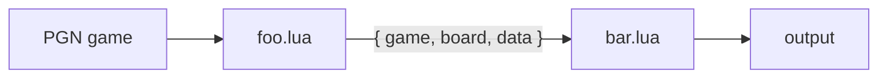

# tictac Lua Plugin Interface

This document specifies the **interface** for tictac's Lua plugin pipeline.
It defines what a plugin looks like, what it receives, and what it returns.

---

## 1. Concept

tictac reads a PGN database and streams each game through an ordered pipeline of
Lua plugins:

```sh
tictac --file database.pgn --plugin foo.lua --plugin bar.lua
```

- Plugins run in the **order given on the command line**.
- For each game, the game flows through `foo.lua` then `bar.lua`.
- Each plugin can **inspect, annotate, filter, fork, or aggregate** games, and
  pass data to the next plugin in the chain.

A single, uniform value — the **pipeline value** `{ game, board, data }` —
travels through the chain. A plugin receives the previous plugin's output and
returns the input to the next plugin. This symmetry is the core of the design
and directly satisfies the requirement of carrying *the game*, *the current
board*, and a *user argument* between stages.



---

## 2. Command-line surface

```sh
tictac --file <db.pgn> [--plugin <spec>]... [--output <file>] [--jobs N] [--on-error <mode>]
```

| Flag | Meaning |
|------|---------|
| `--file`, `-f` | Input PGN database (repeatable; concatenated). |
| `--plugin`, `-p` | A plugin spec (see below). Repeatable; defines pipeline order. |
| `--output`, `-o` | Where surviving games are written (default: stdout, PGN). `-` = stdout, omit with `--no-output`. |
| `--no-output` | Discard the default game stream (useful for pure reporters). |
| `--on-error` | `abort` \| `skip` \| `warn` (default `warn`) — what to do when a plugin raises. |
| `--jobs`, `-j` | Reserved: parallel game workers. Plugins must be written to tolerate it (see §9). |

### Plugin spec & arguments

A plugin spec is a Lua file path, optionally followed by `key=value` arguments:

```sh
--plugin "analyze.lua depth=22 multipv=3 engine=/usr/bin/stockfish"
--plugin filter.lua
--plugin "split.lua by=eco dir=out/"
```

Arguments are exposed to the plugin as `ctx.args` (see §5). Values are strings;
typed accessors (`ctx.args:number`, `:bool`, …) coerce them.

---

## 3. Plugin structure

A plugin file **returns a table** describing the plugin. All fields except
`process` are optional.

```lua
-- echo.lua
local plugin = {}

plugin.meta = {
  name        = "echo",
  version     = "1.0.0",
  description = "Pass games through unchanged; demo of the lifecycle.",
  -- Optional declared argument schema; used for validation and --help.
  args = {
    verbose = { type = "bool", default = false, help = "Log every game." },
  },
}

-- Called once, before any game. Set up engines, open files, read args.
function plugin.init(ctx)
end

-- Called once per game. The heart of the plugin. See §4.
function plugin.process(input, ctx)
  return input            -- pass through unchanged
end

-- Called once, after the last game. Emit reports/aggregates here.
function plugin.finish(ctx)
end

return plugin
```

### Lifecycle

| Hook | When | Typical use |
|------|------|-------------|
| `init(ctx)` | Once, at startup. | Create UCI engines, open output writers, validate args. |
| `process(input, ctx)` | Once per game, in pipeline order. | Inspect / annotate / filter / fork. |
| `finish(ctx)` | Once, after all games. | Emit histograms, reports, opening trees, summaries. |

Engines and writers opened via `ctx` are **closed automatically** by tictac
after `finish`.

---

## 4. The pipeline value & flow control

### Input

`process` receives `(input, ctx)` where `input` is the **pipeline value**:

| Field | Type | Description |
|-------|------|-------------|
| `input.game` | [`Game`](#game) | The game being processed. |
| `input.board` | [`Board`](#board) | The "current" position cursor. For the first plugin it defaults to the game's **final position**. Downstream plugins receive whatever the previous plugin forwarded. |
| `input.data` | any | Arbitrary Lua value passed from the previous plugin. `nil` for the first plugin. |

### Output

`process` returns a **result table** (or shorthand, see below):

| Field | Type | Default | Description |
|-------|------|---------|-------------|
| `action` | string | `"pass"` | Flow control: `"pass"`, `"drop"`, or `"abort"`. |
| `game` | `Game` | `input.game` | Game forwarded to the next plugin. |
| `board` | `Board` | `input.board` | Board cursor forwarded to the next plugin. |
| `data` | any | `input.data` | User payload forwarded to the next plugin. |

```lua
function plugin.process(input, ctx)
  -- ... analysis ...
  return {
    action = "pass",
    game   = input.game,
    board  = somePosition,   -- e.g. hand a "puzzle position" to the next plugin
    data   = { eco = "B33", tags = { "sharp" } },
  }
end
```

### Actions

| Action | Effect |
|--------|--------|
| `"pass"` | Forward to the next plugin; if last plugin, the game goes to the default output. |
| `"drop"` | Remove the game from the pipeline (filters, dedup). Downstream plugins do not see it. |
| `"abort"` | Stop reading the database entirely after this game (early exit; e.g. `--limit` plugins). `finish` still runs. |

### Shorthands

To keep simple plugins terse:

| Return | Equivalent |
|--------|------------|
| `return input` or `return` (nil) | `{ action = "pass" }` — pass through unchanged. |
| `return true` | pass through unchanged. |
| `return false` | `{ action = "drop" }`. |
| `return board` (a Board) | pass, with `board` forwarded as the new cursor. |

### Fan-out (one game → many)

Return an **array** of result tables to inject multiple games into the rest of
the pipeline (variation extractors, position slicers). Each element continues
independently from this plugin onward:

```lua
return {
  { game = white_repertoire },
  { game = black_repertoire },
}
```

---

## 5. `ctx` — the execution context

`ctx` is shared across all hooks of **one plugin** and lives for the whole run.
It is how a plugin talks to tictac.

| Member | Description |
|--------|-------------|
| `ctx.args` | This plugin's parsed CLI arguments (see accessors below). |
| `ctx.shared` | A table shared by **all** plugins and **all** games — global accumulator / cross-plugin channel. |
| `ctx.state` | A table private to **this** plugin instance — convenient scratch across hooks. |
| `ctx.index` | 1-based index of the current game in the database (valid in `process`). |
| `ctx.engine(path, opts)` | Create / fetch a [UCI engine](#engine) handle (managed & auto-closed). |
| `ctx.open(path, mode?)` | Open a [Writer](#writer) (managed & auto-closed). `mode`: `"w"` (default, truncates) / `"a"` (append). Reopening the same path truncates — use `"a"` to append. |
| `ctx.out` | The default output [Writer](#writer) (honours `--output`); **`nil` under `--no-output`**, so guard with `if ctx.out then`. Write to it mid-pipeline with `ctx.out:writeGame(game)`. |
| `ctx.log` | `ctx.log.info/warn/error/debug(fmt, ...)` — structured logging prefixed with plugin + game index. |
| `ctx.image(board, path, opts)` | Render a board to an image file (see [Image](#image-export)). |

### Argument accessors

```lua
ctx.args:get("engine")              -- string or nil
ctx.args:get("engine", "stockfish")-- string with default
ctx.args:number("depth", 20)        -- number with default
ctx.args:bool("verbose", false)     -- boolean with default
ctx.args:require("dir")             -- string; errors if missing
ctx.args:list("tags")               -- "a,b,c" -> { "a", "b", "c" }
```

### Scope summary

- **`input.data`** → per-game, flows *down* the pipeline (stage to stage).
- **`ctx.state`** → per-plugin, persists *across games* (this plugin only).
- **`ctx.shared`** → global, persists across games *and* plugins.

---

## 6. API reference

### Game

Represents one PGN game. Headers, the move list, the result, and access to the
position at any point.

```lua
game:header(key)                 -- header value or nil:  game:header("White")
game:headers()                   -- table: { White=..., Black=..., ECO=..., ... }
game:setHeader(key, value)       -- add/overwrite a header (taggers)
game:removeHeader(key)

game:result()                    -- "1-0" | "0-1" | "1/2-1/2" | "*"
game:moveCount()                 -- number of plies in the mainline
game:moves()                     -- array of Move (mainline)
game:startBoard()                -- Board at the initial position (respects FEN header)
game:board(ply?)                 -- Board after `ply` half-moves (default: final position)

-- Iterate the mainline. Each node: { ply, move, board_before, board_after }
for node in game:positions() do
  -- node.move : Move,  node.board : Board (position after the move)
end

game:pgn()                       -- serialize back to a PGN string
game:clone()                     -- deep copy (safe to mutate before forwarding)
```

> Variations (RAV) are mainline-only in v1; `game:positions{ variations=true }`
> is reserved for a later revision.

### Board

A single position. Thin wrapper over the engine's board type.

```lua
board:fen()                      -- FEN string for the current position
board:setFen(fen)
board:sideToMove()               -- "white" | "black"
board:fullmoveNumber()
board:halfmoveClock()
board:legalMoves()               -- array of Move
board:isLegal(uci_or_san)
board:makeMove(uci_or_san)       -- returns a new Board (immutable style)
board:piece(square)              -- e.g. board:piece("e4") -> "P","n",... or nil
board:pieces(filter?)            -- map square->piece, optional filter {color=,type=}

board:isCheck()
board:isCheckmate()
board:isStalemate()
board:isInsufficientMaterial()
board:isRepetition(count?)
board:phase()                    -- "opening" | "middlegame" | "endgame" (heuristic)
board:material()                 -- { white = n, black = n } in centipawns

board:image(path, opts?)         -- convenience for ctx.image(board, ...)
```

### Move

```lua
move:san()                       -- "Nf3"
move:uci()                       -- "g1f3"
move:from()                      -- "g1"
move:to()                        -- "f3"
move:piece()                     -- "N"
move:isCapture()
move:isCheck()
move:isPromotion()
move:promotion()                 -- "Q" | nil
move:comment()                   -- PGN comment text or nil
move:setComment(text)            -- annotate (blunder-tagger writes "?? -3.2")
move:nags()                      -- array of NAG codes  ($1, $2, ...)
move:addNag(code)
```

### Engine

A UCI engine subprocess. Create once in `init`, reuse across games; tictac
manages the process lifetime.

```lua
local sf = ctx.engine(ctx.args:get("engine", "stockfish"), {
  options = { Threads = 4, Hash = 256 },   -- UCI options (setoption)
})

local r = sf:analyse(board, {
  depth   = 22,        -- one of depth / movetime(ms) / nodes is required
  movetime = nil,
  nodes    = nil,
  multipv  = 1,
})
```

`analyse` returns an **evaluation**:

| Field | Type | Description |
|-------|------|-------------|
| `r.score` | number | Centipawns, **relative to the side to move** (positive = side to move is better). `nil` if mate. |
| `r.mate` | number | Mate in N (signed, side-to-move relative). `nil` if not mate. |
| `r.depth` | number | Reached search depth. |
| `r.nodes`, `r.time`, `r.nps` | number | Search stats. |
| `r.bestmove` | string | Best move (UCI). |
| `r.pv` | array | Principal variation as UCI move strings. |
| `r.lines` | array | When `multipv > 1`: array of `{ score, mate, pv }`, best first. |

Helpers:

```lua
sf:setOption(name, value)
sf:bestmove(board, limits)       -- shorthand: returns just the bestmove UCI string
sf:cp(board, limits)             -- shorthand: returns score in centipawns (signed white-relative)
```

### Writer

An output sink (PGN file, CSV, text, or the default output).

```lua
local w = ctx.open("report.csv")
w:write("white,black,result\n")          -- raw text
w:writef("%s,%s,%s\n", a, b, c)          -- formatted
w:writeGame(game)                        -- serialize a Game as PGN
-- writes are flushed immediately; the writer is auto-closed after finish
```

### Image export

```lua
ctx.image(board, "diagram.png", {
  size        = 512,                 -- pixels
  format      = "png",               -- "png" | "svg"
  flip        = false,               -- orient from black's side
  coordinates = true,                -- file/rank labels
  lastMove    = move,                -- highlight a move's from/to squares
  highlight   = { "e4", "d5" },      -- extra highlighted squares
  arrows      = { { "g1", "f3" } },  -- annotation arrows
  theme       = "default",           -- piece/board theme name
})
-- returns the output path on success; raises on failure.
```

---

## 7. Plugin archetypes (worked examples)

These show that the interface covers the intended plugin families. They are
illustrative, not normative.

### Header filter (with regexp)

```lua
-- filter.lua  →  --plugin "filter.lua white=^Carlsen min_elo=2700"
local plugin = { meta = { name = "filter" } }

function plugin.process(input, ctx)
  local g = input.game
  local white_re = ctx.args:get("white")
  if white_re and not g:header("White"):match(white_re) then
    return false                                   -- drop
  end
  local min = ctx.args:number("min_elo", 0)
  if tonumber(g:header("WhiteElo") or "0") < min then
    return false
  end
  return input                                     -- pass
end

return plugin
```

### Position filter

```lua
function plugin.process(input, ctx)
  local target = ctx.args:require("fen")           -- match a structure
  for node in input.game:positions() do
    if node.board:fen():match("^" .. target) then
      return { game = input.game, board = node.board } -- forward the match position
    end
  end
  return false
end
```

### ECO tagger

```lua
function plugin.process(input, ctx)
  local eco = ctx.shared.eco_book:lookup(input.game)  -- shared lookup table
  input.game:setHeader("ECO", eco.code)
  input.game:setHeader("Opening", eco.name)
  return input
end
```

### Blunder tagger (uses an engine)

```lua
function plugin.init(ctx)
  ctx.state.sf = ctx.engine(ctx.args:get("engine", "stockfish"))
end

function plugin.process(input, ctx)
  local prev
  for node in input.game:positions() do
    local cp = ctx.state.sf:cp(node.board, { depth = 16 })   -- white-relative
    if prev and math.abs(cp - prev) >= 200 then
      node.move:setComment(string.format("blunder (%.2f)", cp / 100))
      node.move:addNag(4)                                     -- $4 = "??"
    end
    prev = cp
  end
  return input
end
```

### Deduplication

```lua
function plugin.init(ctx)
  ctx.state.seen = {}
end

function plugin.process(input, ctx)
  local key = input.game:pgn()                  -- or a normalized move-hash
  if ctx.state.seen[key] then return false end  -- drop duplicate
  ctx.state.seen[key] = true
  return input
end
```

### Game splitter (one DB → many files)

```lua
function plugin.init(ctx)  ctx.state.writers = {} end

function plugin.process(input, ctx)
  local key = input.game:header("ECO") or "NA"
  local dir = ctx.args:get("dir", "out/")
  local w = ctx.state.writers[key]                         -- cache per path yourself:
  if not w then                                            -- reopening would truncate
    w = ctx.open(dir .. key .. ".pgn")
    ctx.state.writers[key] = w
  end
  w:writeGame(input.game)
  return input
end
```

### CSV exporter

```lua
function plugin.init(ctx)
  ctx.state.w = ctx.open(ctx.args:get("out", "games.csv"))
  ctx.state.w:write("white,black,result,eco\n")
end

function plugin.process(input, ctx)
  local g = input.game
  ctx.state.w:writef("%s,%s,%s,%s\n",
    g:header("White"), g:header("Black"), g:result(), g:header("ECO") or "")
  return input
end
```

### ECO histogram / player report (aggregate, emit in `finish`)

```lua
function plugin.init(ctx)  ctx.state.count = {} end

function plugin.process(input, ctx)
  local eco = input.game:header("ECO") or "?"
  ctx.state.count[eco] = (ctx.state.count[eco] or 0) + 1
  return input                                  -- pass games through untouched
end

function plugin.finish(ctx)
  local w = ctx.open("eco_histogram.txt")
  for eco, n in pairs(ctx.state.count) do w:writef("%s\t%d\n", eco, n) end
end
```

### Puzzle finder → diagram (cross-plugin handoff)

```lua
-- puzzle.lua: find a tactical shot, hand the position downstream via board+data
function plugin.process(input, ctx)
  for node in input.game:positions() do
    local r = ctx.state.sf:analyse(node.board, { depth = 20, multipv = 2 })
    if r.mate and r.mate <= 3 then
      return { game = input.game, board = node.board,
               data = { puzzle = true, mate = r.mate, pv = r.pv } }
    end
  end
  return false
end

-- diagram.lua: render whatever board the previous plugin selected
function plugin.process(input, ctx)
  if input.data and input.data.puzzle then
    ctx.image(input.board, string.format("puzzle_%d.png", ctx.index),
              { size = 480, flip = input.board:sideToMove() == "black" })
  end
  return input
end
```

### Endgame classifier

```lua
function plugin.process(input, ctx)
  local b = input.game:board()                 -- final position
  if b:phase() == "endgame" then
    input.game:setHeader("Endgame", classify(b:pieces()))  -- e.g. "R+P vs R"
  end
  return input
end
```

### Opening tree (aggregate)

```lua
function plugin.process(input, ctx)
  local node = ctx.shared.tree                  -- shared trie of positions
  for _, mv in ipairs(input.game:moves()) do
    if ctx.index_ply and ctx.index_ply > 12 then break end
    node = node:child(mv:san())
    node.games = node.games + 1
  end
  return input
end
-- finish: serialize ctx.shared.tree to JSON/PGN.
```

---

## 8. Execution semantics

1. tictac parses the database and, for **each game in order**, builds the initial
   pipeline value `{ game, board = final_position, data = nil }`.
2. The value is passed to plugin 1's `process`, whose result feeds plugin 2, etc.
3. A `"drop"` short-circuits the remaining plugins for that game.
4. After the last plugin, a surviving game (`"pass"`) is written to `ctx.out`
   (unless `--no-output`).
5. `"abort"` finishes the current game's pipeline, then stops reading the DB.
6. After all games, each plugin's `finish` runs **in pipeline order**.
7. All managed engines and writers are closed.

### Errors

- A plugin may `error("message")`. Behavior follows `--on-error`:
  `abort` (stop), `skip` (drop the game, continue), `warn` (log + treat as pass).
- `ctx.args:require` and `analyse` with no limit raise descriptive errors.

---

## 9. Open questions / decisions for review

These are the points I'd like you to confirm before implementation:

1. **Pipeline value shape.** Is the symmetric `{ game, board, data }` in/out the
   model you want, or would you prefer `process(game, ctx)` with the carried
   payload living only in `ctx`? (I recommend the symmetric value — it makes the
   cross-plugin handoff explicit and matches your stated requirement.)
2. **`board` cursor semantics.** Default the first plugin's `board` to the
   **final** position (proposed) or the **initial** position? Most analyzers
   iterate `game:positions()` anyway and use the cursor only for handoff.
3. **Plugin argument syntax.** `--plugin "file.lua key=val key2=val2"`
   (proposed) vs. a separate flag (`--plugin file.lua --arg file:key=val`) vs.
   per-plugin Lua config files.
4. **Default output.** Should surviving games go to stdout by default, or should
   output be silent unless `--output` is given?
5. **Fan-out.** Keep the "return an array of results" fan-out, or restrict
   multi-game production to explicit `ctx.out:writeGame` calls?
6. **Concurrency (`--jobs`).** If we ever parallelize game workers, `ctx.shared`
   needs a defined concurrency model (per-worker shards merged in `finish`, or a
   lock). Worth deciding now so the interface doesn't change later.
7. **Score sign convention.** `analyse().score` is **side-to-move relative**
   (UCI native); the `:cp()` shorthand is **white-relative**. Confirm this split
   is intuitive.
8. **Variations.** v1 is mainline-only. Confirm that's acceptable for the first
   cut.
