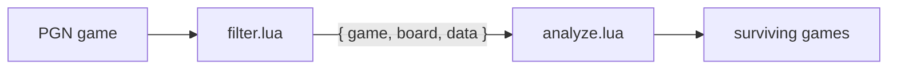

# tictac

**A lightweight, Lua-scriptable processor for large PGN chess databases.**

`tictac` streams a PGN database through an ordered pipeline of single-purpose Lua plugins.
Each plugin can inspect, annotate, filter, fork, or aggregate games and hand the
result to the next plugin in the chain -- filter by header or position, tag openings,
analyze with a UCI engine, split databases, build reports, and much more. The engine
stays small and fast; the Lua layer makes it endlessly versatile.

> **The name.** *tictac* is an anagram of **tactic** -- a nod to the original
> motivation, mining chess tactics of very specific types from large collections,
> though the tool grew into a general-purpose game processor. It's also a nod to the
> Pentagon's "Tic Tac" UAP video, keeping with a habit of naming projects after
> UFO lore.

## Why

- **Lightweight & straightforward** -- a single native binary, no runtime services.
- **Powerful through composition** -- a chain of plugins turns simple building
  blocks into an unbounded space of queries and transformations.
- **Extensible in Lua** -- describe what you're looking for in a few lines; no
  recompilation, no C++ required.
- **Streaming** -- games flow through one at a time, so databases far larger than
  memory are fine.

## How it works

A single, uniform **pipeline value** -- `{ game, board, data }` -- travels through
the chain. Each plugin receives the previous plugin's output and returns the input
to the next stage.



Plugins run in the order given on the command line. A plugin exposes up to three
lifecycle hooks -- `init` (once, at startup), `process` (once per game), and
`finish` (once, at the end, for reports/aggregates).

## Usage

```sh
tictac --file <db.pgn> [--plugin <spec>]... [--output <file>] [--on-error <mode>]
```

| Flag | Meaning |
|------|---------|
| `-f`, `--file` | Input PGN database (repeatable; concatenated). |
| `-p`, `--plugin` | A plugin spec: `"file.lua key=value ..."`. Repeatable; defines pipeline order. |
| `-o`, `--output` | Where surviving games are written (default: stdout, PGN). |
| `--no-output` | Discard the default game stream (useful for pure reporters). |
| `--on-error` | `abort` \| `drop` \| `pass` (default `abort`) -- how a plugin's failing `process()` is handled: `abort` halts the run, `drop` drops the game, `pass` passes it through unchanged; all three log the error. A failing `init` always aborts. |

For example, keep only Fischer's white games and write them out:

```sh
tictac --file games.pgn --plugin "filter.lua white=^Fischer" --output fischer.pgn
```

See [`plugins/`](plugins/) for runnable examples (`echo.lua`, `filter.lua`).

## Build

Requires **Clang** with C++23 support including `<print>` (Clang ≥ 18; the build
uses `clang++`) and **CMake ≥ 3.14**. All dependencies
([CLI11](https://github.com/CLIUtils/CLI11),
[chess-library](https://github.com/Disservin/chess-library),
[Lua](https://www.lua.org/), and [sol2](https://github.com/ThePhD/sol2)) are
fetched automatically by CMake.

```sh
./build.sh
```

## Testing

The test suite drives the built `tictac` binary through
[ctest](https://cmake.org/cmake/help/latest/manual/ctest.1.html): each case runs
a small Lua plugin (under [`tests/plugins/`](tests/plugins/)) over a PGN fixture
(under [`tests/fixtures/`](tests/fixtures/)) and asserts the plugin contract --
every return type (valid and invalid), `input.data` flowing down the pipeline,
per-plugin `ctx.scope`, global `ctx.shared`, and the Game/Board/Move API.

Build and run everything:

```sh
./test.sh
```

Or, once the project is built, run the tests on their own (optionally filtering
by name):

```sh
ctest --test-dir build --output-on-failure
ctest --test-dir build -R return_   # only the return-contract tests
```

## Writing plugins

A plugin is a Lua file that returns a table. The only required field is
`process`:

```lua
-- filter.lua -- keep games whose White player matches a pattern.
local plugin = { meta = { name = "filter" } }

function plugin.process(input, ctx)
  local white_re = ctx.args:get("white")
  if white_re and not (input.game:header("White") or ""):match(white_re) then
    return false          -- drop this game
  end
  return input            -- pass it through
end

return plugin
```

The full plugin interface -- the pipeline value, flow-control return conventions,
the `ctx` API (engines, writers, board/move/game accessors), and the
argument schema -- is specified in **[LUA.md](LUA.md)**.

## License

GPL-3.0-or-later. See [LICENSE](LICENSE).
